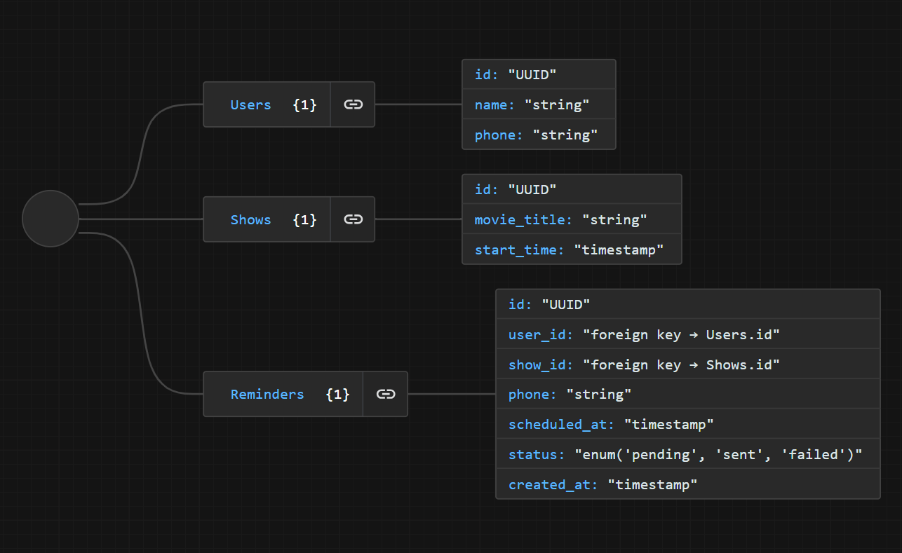
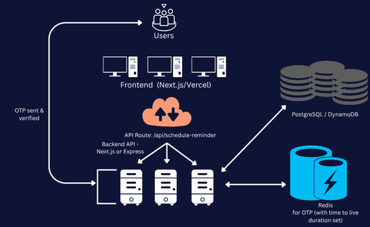
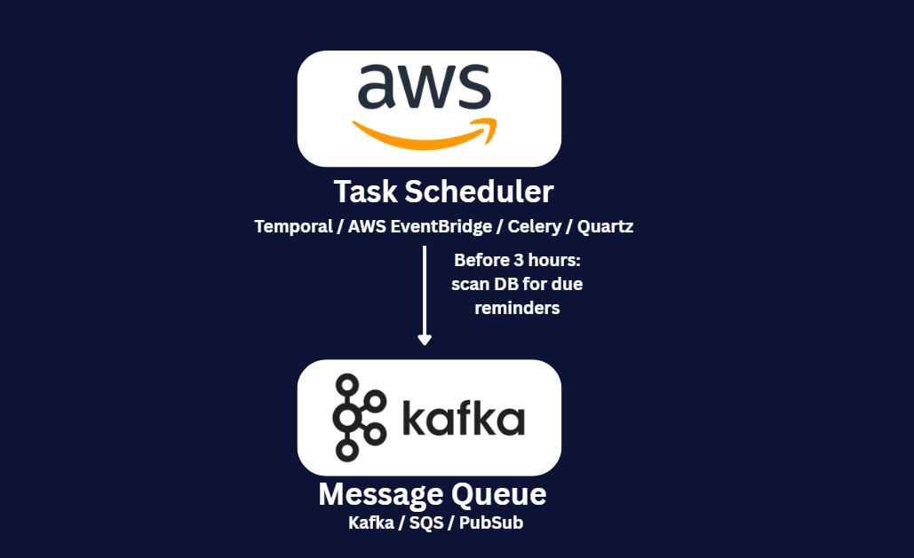
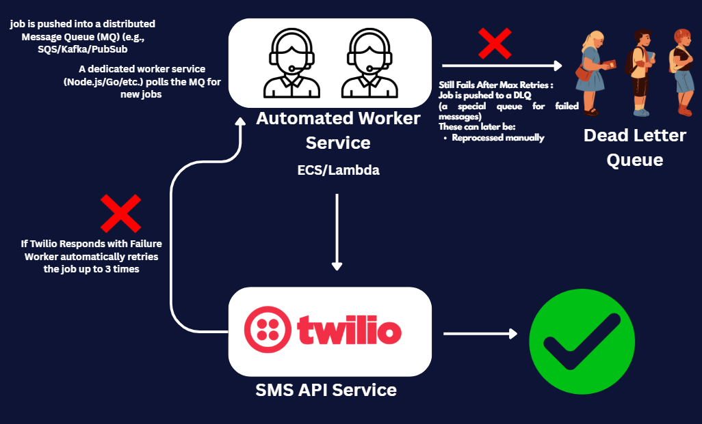

#  BookMyShow Home Page Clone + SMS Reminder Feature

This is a **modern clone of the BookMyShow home page**, built with a focus on real-world learning, UI replication, and backend feature development. On top of the core UI, I added a **“Remind Me” SMS feature** that lets users schedule a message after they click on a movie—just like a smart ticketing assistant.

The goal wasn’t just to copy the UI, but to **integrate full-stack features** using modern tools and deploy them like a real-world project.

---

##  Tech Stack & Tools

<table>
  <thead>
    <tr>
      <th>Layer</th>
      <th>Tech Used</th>
    </tr>
  </thead>
  <tbody>
    <tr>
      <td>Frontend</td>
      <td>Next.js (App Router), TypeScript, Tailwind CSS</td>
    </tr>
    <tr>
      <td>State & Forms</td>
      <td>React Hooks, Controlled Inputs</td>
    </tr>
    <tr>
      <td>SMS Messaging</td>
      <td>Twilio API</td>
    </tr>
    <tr>
      <td>Delay Scheduling</td>
      <td>GitHub Actions + Cron, with Secret Auth</td>
    </tr>
    <tr>
      <td>Environment Config</td>
      <td>.env.local, GitHub Secrets, Vercel Env</td>
    </tr>
    <tr>
      <td>Deployment</td>
      <td>Vercel (Frontend + API Routes)</td>
    </tr>
    <tr>
      <td>Optional Storage</td>
      <td>Redis via Upstash (attempted, not used in final)</td>
    </tr>
  </tbody>
</table>

---

##  Features

- **Movie reminder form** → Enter your name and phone number.
- **SMS delay logic** → Message is sent *1 minute* after submission.
- **Secure API** → Rate-limited and protected with secrets.
- **Workflow automation** → Uses GitHub Actions to simulate cron jobs.
- **Typed backend** → Full use of TypeScript for request validation and safety.

---

## Journey
<table>
  <thead>
    <tr>
      <th>BookMyShow Integration Need</th>
      <th>My System Design Approach</th>
    </tr>
  </thead>
  <tbody>
    <tr>
      <td>Reminder system for upcoming events</td>
      <td>Built with GitHub Actions-based cron system</td>
    </tr>
    <tr>
      <td>Real-time SMS delivery</td>
      <td>Twilio API used with 1-minute timeout</td>
    </tr>
    <tr>
      <td>Backend storage or queue</td>
      <td>Explored Upstash Redis but moved to stateless</td>
    </tr>
    <tr>
      <td>Security and spam prevention</td>
      <td>Secrets validated in API route</td>
    </tr>
  </tbody>
</table>

---

##  Source Highlights

- **Home Page UI** – [`src/app/page.tsx`](./src/app/page.tsx)
- **SMS API Logic** – [`src/app/api`](./src/app/api)
- **Utilities** – [`src/lib/utils.ts`](./src/lib/utils.ts)
- **GitHub Action Workflow** – [`.github/workflows/schedule.yml`](./.github/workflows/schedule.yml)

---

##  Disclaimer

This project is for learning and experimentation purposes only. Not affiliated with BookMyShow or intended for production use.

---

##  Design Evolution

<table>
  <thead>
    <tr>
      <th>Attempt</th>
      <th>Description</th>
    </tr>
  </thead>
  <tbody>
    <tr>
      <td><strong>Instant SMS (In-Memory)</strong></td>
      <td>Initial logic using <code>setTimeout</code> to delay SMS by 1 min; not production safe</td>
    </tr>
    <tr>
      <td><strong>Redis + Cron (Upstash)</strong></td>
      <td>Attempted Redis queue with Upstash and Vercel cron — not supported on free tier</td>
    </tr>
    <tr>
      <td><strong>GitHub Actions</strong></td>
      <td>Final working system uses GitHub Actions every minute to trigger <code>/api/sms-cron</code> via secure endpoint</td>
    </tr>
  </tbody>
</table>

---

##  System Design 

<table>
  <thead>
    <tr>
      <th>What BookMyShow Would Need to Implement Such a Service</th>
      <th>My System Design</th>
    </tr>
  </thead>
  <tbody>
    <tr>
      <td style="vertical-align:top; min-width:320px;">
        <ul>
          <li><strong>Distributed Message Queue</strong>: Use Amazon SQS, Apache Kafka, or Google Pub/Sub to enqueue SMS jobs with retries, visibility timeouts, and scalability.</li>
          <li><strong>Dedicated Job Workers</strong>: Deploy background services in Node.js, Go, or Java (on AWS Lambda, ECS, or Kubernetes) that poll queues and send SMS via Twilio or in-house gateways.</li>
          <li><strong>Reliable Task Scheduling</strong>: Replace GitHub Actions with Temporal, Quartz, Celery, or AWS EventBridge for robust, fault-tolerant, production-grade scheduling.</li>
          <li><strong>Rate Limiting & Throttling</strong>: Prevent abuse by limiting API usage per user/IP using API Gateway + Redis counters or WAFs at the CDN layer.</li>
          <li><strong>Phone Number Verification</strong>: Use OTP-based verification before allowing reminder scheduling to prevent spam and reduce SMS cost.</li>
          <li><strong>Logging & Monitoring</strong>: Use Prometheus, Grafana, New Relic, or Datadog for observability; stream logs to ELK or CloudWatch for debugging and audit.</li>
          <li><strong>Configurable Reminders</strong>: Let users pick when they want reminders (e.g., 1 hour, 3 hours) and dynamically schedule based on showtime.</li>
          <li><strong>User Preferences DB</strong>: Store reminder preferences and subscriptions in PostgreSQL, Aurora, or DynamoDB for reliable data access.</li>
          <li><strong>Multi-Gateway SMS Failover</strong>: Integrate multiple SMS vendors (e.g., Twilio, MSG91, Kaleyra) and add fallback logic if one provider fails.</li>
          <li><strong>Admin Dashboard</strong>: Build an internal tool to view, edit, or cancel reminder jobs, and monitor SMS delivery and logs.</li>
          <li><strong>Scalable API Infrastructure</strong>: Host APIs behind load balancers using autoscaling containers or serverless functions, with Redis/CDN caching for high traffic.</li>
          <li><strong>Security & Abuse Protection</strong>: Sanitize inputs, require authentication, add captchas, enforce API gateway protection, and block abusive IPs.</li>
        </ul>
      </td>
      <td style="vertical-align:top; min-width:220px;">
        <ul>
          <li><strong>Enterprise-grade SMS pipeline</strong>: <code>GitHub Actions</code> as CRON trigger</li>
          <li><strong>Persistent message queue (e.g., Kafka)</strong>: <code>Redis</code> (initially attempted with Upstash)</li>
          <li><strong>Scalable job scheduler</strong>: <code>GitHub Actions</code> (every 1 min)</li>
          <li><strong>Fault tolerance, retry logic</strong>: Basic validation and logging</li>
        </ul>
      </td>
    </tr>
  </tbody>
</table>

## Schema

##  System Architecture

---

##  Testing & Verification

- SMS received after 1-minute delay ✅  
- Environment variables injected via GitHub + Vercel + Local `.env` ✅  
- Protected `/api/sms-cron` with Bearer token for GitHub Workflow ✅  
- Logging in both local and cloud environments ✅  

---

##  Security Measures

- No secrets in code
- All secrets managed via `.env`, Vercel, GitHub Actions Secrets
- `/api/sms-cron` protected with Bearer token (`SMS_CRON_SECRET`)
- SMS logic only executes if request is authenticated

---

##  Future Improvements

- Move SMS queue to Redis or Durable KV
- Build dashboard to monitor queued and sent messages

---
